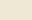

# use-solarized

React Hook for using the [Solarized color scheme](https://ethanschoonover.com/solarized/).

## Install

```sh
yarn add use-solarized
# or
npm install use-solarized
```

## Basic Usage

```js
import React from "react";
import useSolarized from "use-solarized";

const App = () => {
  const { colors, toggleColorMode } = useSolarized();

  return (
    <div
      style={{
        color: colors.text,
        backgroundColor: colors.background,
      }}
    >
      <button onClick={toggleColorMode}>Click Me</button>
    </div>
  );
};
```

## API

### Initialization

`useSolarized()` has a boolean argument defining if it should start in light mode or not. Using no argument will default to light mode.

```js
const App = () => {
  const { colors } = useSolarized(false); // dark mode
};
```

### toggleColorMode

Calling `toggleColorMode()` will toggle between light mode and dark mode.

### Accent Colors

Solarized has 8 accent colors, which can either be accessed by name or by index:

| Index | Key       | Code    | Color                            |
| ----- | --------- | ------- | -------------------------------- |
| 0     | `yellow`  | #b58900 |    |
| 1     | `orange`  | #cb4b16 |    |
| 2     | `red`     | #dc322f |          |
| 3     | `magenta` | #d33682 |  |
| 4     | `violet`  | #6c71c4 |    |
| 5     | `blue`    | #268bd2 |        |
| 6     | `cyan`    | #2aa198 |        |
| 7     | `green`   | #859900 |      |

```js
const { colors } = useSolarized();
colors.yellow; // "#b58900"
colors[4]; // "#6c71c4"
```

### Content Colors

Solarized has 8 content colors, using 5 for light mode and 5 for dark mode:

#### Light Mode

| Name   | Key          | Code    | Color                          | Description                 |
| ------ | ------------ | ------- | ------------------------------ | --------------------------- |
| base01 | `emphasized` | #586e75 |  | Optional emphasized content |
| base00 | `primary`    | #657b83 |  | Body text / primary content |
| base1  | `secondary`  | #93a1a1 |    | Secondary content           |
| base2  | `highlight`  | #eee8d5 |    | Background highlights       |
| base3  | `background` | #fdf6e3 |    | Bachground                  |

#### Dark Mode

| Name   | Key          | Code    | Color                          | Description                 |
| ------ | ------------ | ------- | ------------------------------ | --------------------------- |
| base1  | `emphasized` | #93a1a1 |    | Optional emphasized content |
| base0  | `primary`    | #839496 |    | Body text / primary content |
| base01 | `secondary`  | #586e75 |  | Secondary content           |
| base02 | `highlight`  | #073642 |  | Background highlights       |
| base03 | `background` | #002b36 |  | Bachground                  |

```js
const { colors, toggleColorMode } = useSolarized();
colors.primary; // "#657683"
colors["background"]; // "#fdf6e3"
toggleColorMode();
colors.primary; // "#839496"
colors["background"]; // "#002b36"
```

## License

MIT
